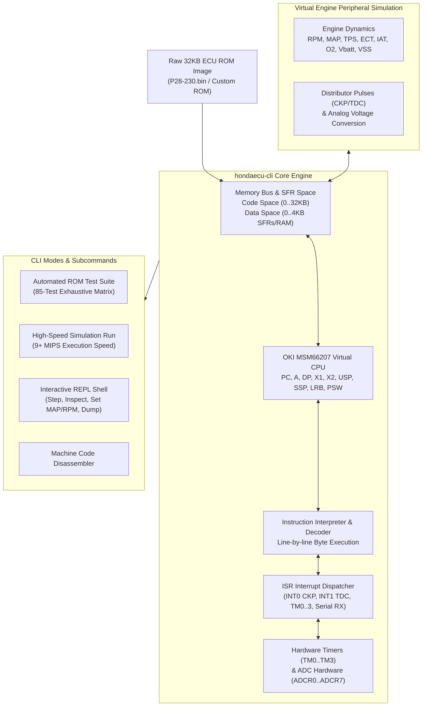

# Honda OBD1 ECU (OKI MSM66207) Emulator & ROM Testing Suite in Rust

[](LICENSE)
[](https://www.rust-lang.org/)
[]()
[]()

A high-performance command-line emulator and ROM testing suite for **Honda OBD1 ECUs** (P28, P30, P72, PR4) powered by an OKI MSM66207 16-bit CPU virtual core and peripheral hardware simulation.

---

## 📚 Documentation Index

- 📖 [**Real-World Scenario Playback Guide (`docs/SCENARIOS.md`)**](docs/SCENARIOS.md): Complete guide to preset runtime engine scenarios (Overrun DFCO, Drag Strip Pass, Accel Tip-In Stomp, VTEC Hysteresis, Electrical Idle Load, Heat Soak Start, Cold Start) and writing custom CSV datalog traces.
- 📐 [**Honda P28 ECU Hardware Architecture (`docs/P28_ARCHITECTURE.md`)**](docs/P28_ARCHITECTURE.md): Deep technical specification of OKI MSM66207 memory mapping, Special Function Registers (SFRs), Interrupt Vector Table, Fuel & Ignition math formulas, VTEC logic, and DTC diagnostic pipeline.

---

## 📌 Architectural Overview



---

## 🔥 Key Features

- **Byte-Precise OKI MSM66207 Virtual CPU**: Interprets raw machine code opcode bytes line-by-line using a virtual register file (`A`, `DP`, `X1`, `X2`, `USP`, `SSP`, `LRB`, `er0`–`er3`, `r0`–`r7`) with word/byte accumulator mode switching (`DD` flag) and borrow-correct carry flags (`CF`).
- **Microsecond-Accurate ISR Timing**: Simulates hardware timers (`TM0`–`TM3`, `TMR0`–`TMR3`) and distributor position pulse interrupts (`INT0` CKP crankshaft pulse and `INT1` TDC/CYP cylinder position pulse).
- **ADC Hardware & Sensor Simulation**: Simulates analog-to-digital conversion (`ADSCAN`, `ADCR0`–`ADCR7`) for engine sensors: MAP (Manifold Absolute Pressure), TPS (Throttle Position), ECT (Engine Coolant Temp), IAT (Intake Air Temp), O2, Battery Voltage, and VSS.
- **VTEC Spool Valve & Pressure Switch**: Models VTEC spool valve solenoid engagement outputs and oil pressure switch feedback hysteresis logic (RPM >= 4800, TPS >= 20%, ECT >= 60°C).
- **UART Serial Datalogging Protocol**: Implements serial RX/TX protocol handler (vector `0x01FD`, Baud rate 38400, command frames like `0x20` sensor payload data used by Honda Tuning Suite, Neptune, and Crome).
- **85-Test Exhaustive ROM Matrix Suite**: Sweeps 400 fuel map grid cells, 400 ignition map timing cells, environmental trims (cold start, battery dead-time, overheat retard), and rev limiters.
- **Complete 30-DTC OBD1 Honda Fault Code Support**: Covers all official Honda OBD1 fault codes (DTC 0 through DTC 92).
- **Interactive REPL Console**: Live interactive shell to step instructions, set RPM/MAP/TPS parameters, dump memory, and monitor calculated fuel injection pulse width and IACV duty cycles.
- **Blazing Performance**: Executes **9.01+ Million Instructions per second** (~9.01 MHz virtual CPU speed) in Rust.

---

## ⚡ Quickstart & Installation

### Option 1: Download Standalone Binaries (No Rust Required!)
Download the pre-compiled binary for your operating system from [**GitHub Releases**](https://github.com/VIRUXE/hondaecu-cli/releases):

- **Windows (`.exe`)**: Download `hondaecu-cli-windows-x86_64.zip`, extract, and open Command Prompt or PowerShell.
- **Linux (`x86_64`)**: Download `hondaecu-cli-v0.1.0-x86_64-unknown-linux-gnu.tar.gz` and extract `hondaecu-cli`.

### Option 2: Building from Source (Rust Developers)
```bash
git clone https://github.com/VIRUXE/hondaecu-cli.git
cd hondaecu-cli
cargo build --release
```

---

## 📖 Usage Examples

> **Note**: For Windows, replace `./hondaecu-cli` with `.\hondaecu-cli.exe`.

### 1. Run Complete Automated ROM Test Suite
```bash
# Linux / macOS
./hondaecu-cli test P28-230.bin

# Windows (PowerShell / CMD)
.\hondaecu-cli.exe test P28-230.bin
```

### 2. ECU Datalog CSV Replay & Scripted Trace Playback
Replay an actual CSV driving log or scripted engine preset through the ECU and export calculated pulse width & VTEC status:
```bash
# Replay built-in dyno pull preset (2000 -> 8200 RPM WOT)
./hondaecu-cli replay P28-230.bin dyno-pull output_results.csv

# Replay fault injection scenario (MAP sensor disconnect -> DTC 3)
./hondaecu-cli replay P28-230.bin error-map-failure

# Replay custom CSV datalog file
./hondaecu-cli replay P28-230.bin my_ecu_log.csv output_results.csv
```

CSV Format (`my_ecu_log.csv`):
```csv
timestamp_ms,rpm,map_kpa,tps_pct,ect_celsius,iat_celsius,o2_volts,vbatt_volts,speed_kmh
0,800,30,0,85,25,0.45,14.2,0
100,2200,45,15,85,25,0.45,14.2,20
200,4800,95,100,85,25,0.85,14.1,80
```

Available presets: `dyno-pull`, `overrun-decel`, `accel-stomp`, `drag-pass`, `error-map-failure`, `error-ect-overheat`, `error-tps-short`, `error-vtec-oil-pressure-loss`, `cold-start`, `electrical-load-idle`, `heat-soak-start`. See [`docs/SCENARIOS.md`](docs/SCENARIOS.md) for full scenario descriptions.

### 3. High-Speed ECU Simulation Run
Simulate ECU execution for 100,000 cycles at a simulated 3000 RPM:
```bash
./hondaecu-cli run P28-230.bin 100000 3000
```

### 4. Interactive Debugging REPL
Launch the interactive shell to single-step, inspect registers, and manipulate virtual engine parameters in real time:
```bash
./hondaecu-cli interactive P28-230.bin
```

Interactive commands:
```text
ecu [0x21E2]> step 5
ecu [0x21EA]> regs
ecu [0x21EA]> set rpm 6500
ecu [0x21EA]> set map 100
ecu [0x21EA]> set tps 100
ecu [0x21EA]> status
ecu [0x21EA]> dump 0x0060 16
```

### 5. Machine Code Disassembler
Disassemble instructions starting at a given hexadecimal memory offset:
```bash
./hondaecu-cli disasm P28-230.bin 0x21E2 20
```

---

## 🚦 Honda OBD1 Diagnostic Trouble Code (DTC) Matrix

The test suite validates all 30 official Honda OBD1 fault codes:

| DTC Code | Component Name | Description & Fault Condition | Status |
|---|---|---|---|
| **DTC 0** | ECU Internal ROM | Corrupt Checksum / Modulo Sum Mismatch (Solid CEL) | **PASSED** |
| **DTC 1** | Primary O2 Sensor | Signal out of range (<0.1V / >1.1V / Open circuit) | **PASSED** |
| **DTC 2** | Secondary O2 Sensor | Secondary O2 circuit fault (JDM / Lean spot) | **PASSED** |
| **DTC 3** | MAP Sensor High/Low | Manifold Absolute Pressure sensor out of bounds | **PASSED** |
| **DTC 4** | CKP Position Sensor | Crankshaft position pulse signal missing at high RPM | **PASSED** |
| **DTC 5** | MAP Sensor Range | Vacuum mismatch vs engine RPM/TPS | **PASSED** |
| **DTC 6** | ECT Engine Temp | Coolant temp sensor open (<0.2V) or shorted (>4.8V) | **PASSED** |
| **DTC 7** | TPS Throttle Sensor | Throttle position voltage out of bounds (<0.3V or >4.8V) | **PASSED** |
| **DTC 8** | TDC Sensor Pulses | Top Dead Center distributor pulse sync fault | **PASSED** |
| **DTC 9** | CYP Sensor Pulses | Cylinder position pulse phase fault | **PASSED** |
| **DTC 10** | IAT Intake Air Temp | Air temp voltage open (<0.2V) or shorted (>4.8V) | **PASSED** |
| **DTC 11** | Ignition Module | Distributor igniter module pulse missing | **PASSED** |
| **DTC 12** | EGR System | EGR valve position sensor out of range | **PASSED** |
| **DTC 13** | BARO Sensor | Atmospheric pressure sensor internal circuit fault | **PASSED** |
| **DTC 14** | IACV Idle Valve | Idle Air Control Valve open/short circuit | **PASSED** |
| **DTC 15** | Ignition Coil Output | Ignition coil primary circuit failure | **PASSED** |
| **DTC 16** | Injector Driver | Fuel injector driver transistor open/short | **PASSED** |
| **DTC 17** | VSS Speed Sensor | Missing speed pulse while RPM > 2000 & high MAP | **PASSED** |
| **DTC 19** | A/T Lockup Solenoid | Automatic transmission lockup solenoid circuit fault | **PASSED** |
| **DTC 20** | ELD Load Detector | Fuse box ELD current sensor out of range | **PASSED** |
| **DTC 21** | VTEC Solenoid | VTEC solenoid coil open/short circuit | **PASSED** |
| **DTC 22** | VTEC Pressure Switch | Low oil pressure / switch open when VTEC commanded | **PASSED** |
| **DTC 23** | Knock Sensor (KS) | Knock sensor circuit open or signal noise fault | **PASSED** |
| **DTC 30** | A/T Shift Signal A | Automatic transmission shift solenoid A circuit | **PASSED** |
| **DTC 31** | A/T Shift Signal B | Automatic transmission shift solenoid B circuit | **PASSED** |
| **DTC 41** | O2 Sensor Heater | Oxygen sensor heater element circuit open/short | **PASSED** |
| **DTC 43** | Fuel Supply System | Fuel pressure or O2 trim lean limit exceeded | **PASSED** |
| **DTC 45** | Fuel System Rich/Lean | Air/Fuel ratio out of closed-loop correction range | **PASSED** |
| **DTC 48** | LAF Wideband Sensor | Linear air-fuel ratio sensor circuit fault (Civic VX) | **PASSED** |
| **DTC 92** | EVAP Purge Solenoid | Evaporative emissions purge solenoid circuit | **PASSED** |

---

## 📂 Project Directory Structure

```text
hondaecu-cli/
├── Cargo.toml
├── README.md
├── LICENSE
└── src/
    ├── main.rs         # CLI Entrypoint & subcommand dispatcher
    ├── cpu.rs          # OKI MSM66207 CPU Register File & PSW Flags
    ├── bus.rs          # Memory Bus (32KB ROM / 4KB RAM), Timers, SFRs, ADC, PWM
    ├── engine.rs       # Virtual Engine Simulator, Sensor Signals, Distributor Pulses
    ├── interpreter.rs  # Machine Code Opcode Decoder & Interpreter
    ├── interrupts.rs   # ISR Vector Dispatcher (INT0, INT1, TM0-TM3, Serial RX)
    ├── dtc.rs          # Complete 30 Honda OBD1 DTC Diagnostic Fault Module
    ├── suite.rs        # 85-Test Exhaustive Matrix Test Suite
    └── interactive.rs  # Interactive Debugging REPL Shell
```

---

## 📜 License

This is free and unencumbered software released into the public domain under [The Unlicense](LICENSE).
